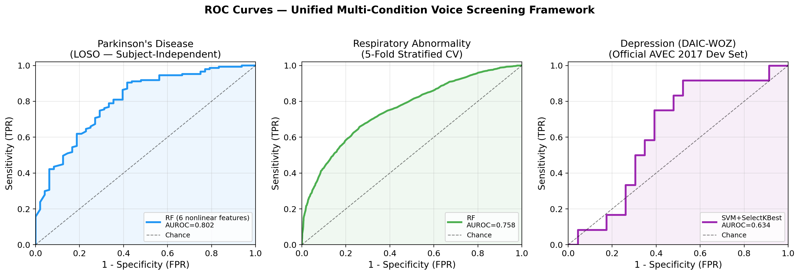
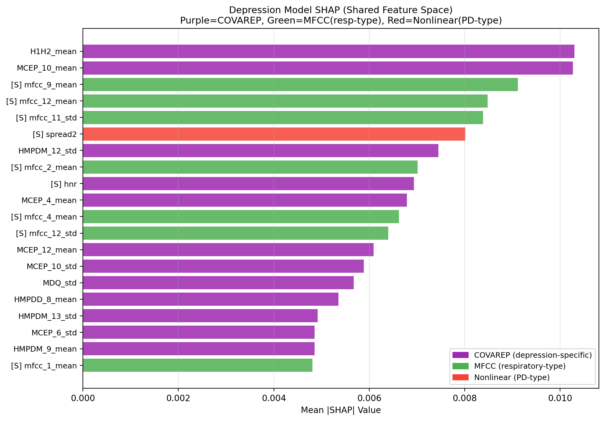

# PulseIQ AI: Condition-Specific Acoustic Feature Attribution Across Parallel Voice Screening Tasks

[](https://python.org)
[](LICENSE)

Official implementation of *Condition-Specific Acoustic Feature Attribution Across Parallel Voice Screening Tasks for Parkinson's Disease, COVID-19 Respiratory Screening, and Depression: A Rigorous Multi-Dataset Evaluation with SHAP Explainability*.

Aditya Raj and Dr. Prashant Kumar. Department of Computer Science (AI/ML), Bennett University, Greater Noida, India.

## Overview

PulseIQ AI applies one consistent evaluation methodology, in parallel, to three independent voice screening tasks: Parkinson's disease (UCI Parkinson's), COVID-19 respiratory screening (Coswara), and depression (DAIC-WOZ, AVEC 2017). Each task uses a separate dataset, subject population, and feature space. This is a parallel evaluation under a shared methodological framework, not simultaneous multi-condition screening from a single individual.

The primary contribution is a within-recording feature attribution analysis. When PD-type nonlinear features, COVID-19-type MFCCs, and depression-specific COVAREP features are extracted from the same DAIC-WOZ recordings, the depression classifier assigns only 2.6% of its SHAP attribution to nonlinear features, which are the dominant predictor for Parkinson's disease. The result is stable across 200 bootstrap resamples (2.51 ± 1.15%, 95% CI [0.89, 5.25]).

This repository supports a research contribution on evaluation methodology and explainability. It is not a medical device and is not intended for clinical use.

## Contributions

- A parallel single-condition evaluation pipeline using condition-appropriate protocols: Leave-One-Subject-Out for PD, the official AVEC 2017 split for depression, and recording-level 5-fold cross-validation for COVID-19.
- A within-recording SHAP attribution analysis showing that PD-discriminative features account for 2.6% of depression-model attribution, with bootstrap validation of stability.
- Evidence that six nonlinear dynamics features alone outperform all 22 UCI features for PD by +0.057 AUROC under subject-independent evaluation (DeLong p = 0.039).
- An exploratory comparison of wav2vec 2.0 against COVAREP features in the low-data clinical regime.
- Explicit reporting of negative results: failed cross-dataset generalisation, non-significant depression detection, and zero significant PHQ-8 symptom correlations.

## Results

Primary screening results. The Parkinson's and COVID-19 results are statistically significant and constitute the primary claims. Depression is reported as an exploratory pilot replication of the AVEC 2017 baseline (0.630) and is not a clinical performance claim.

| Condition | Model | Protocol | AUROC [95% CI] | BACC | F1 | Brier | ECE |
|-----------|-------|----------|----------------|------|-----|-------|-----|
| Parkinson's Disease | RF (6 nonlinear features) | LOSO | 0.802 [0.728–0.870] | 0.660 | 0.880 | 0.144 | 0.102 |
| COVID-19 Respiratory | Random Forest | 5-fold CV | 0.758 [0.744–0.771] | 0.695 | 0.667 | 0.202 | 0.063 |
| Depression (exploratory) | SVM + SelectKBest | AVEC 2017 dev | 0.634 [0.300–0.705] | 0.698 | 0.629 | 0.222 | 0.091 |



*ROC curves. Left: PD under subject-independent LOSO. Centre: COVID-19 respiratory under 5-fold CV. Right: depression under the official AVEC 2017 development set (exploratory, non-significant).*

### Primary finding: within-recording attribution separability

When all three feature families are extracted from the same DAIC-WOZ recordings and presented to the depression classifier, SHAP attribution splits as follows:

| Feature type | Example features | Depression SHAP share | Dominant for |
|--------------|------------------|-----------------------|--------------|
| COVAREP (depression-specific) | H1H2, MCEP, HMPDM, MDQ | 74.2% | Depression |
| MFCC (respiratory-type) | mfcc 9, mfcc 12, mfcc 2 | 23.2% | COVID-19 |
| Nonlinear dynamics (PD-type) | spread2, PPE, RPDE, DFA | 2.6% | Parkinson's |



*SHAP attribution for depression in the shared feature space. The near-zero contribution of PD-type nonlinear features (2.6%) indicates attribution separability within identical audio recordings.*

### Additional findings

- **Nonlinear feature superiority (PD).** Six nonlinear dynamics features reach AUROC 0.802, against 0.745 for all 22 UCI features (DeLong z = 2.07, p = 0.039). Removing shimmer and HNR/NHR improves LOSO performance.
- **Model selection.** Random Forest significantly outperforms logistic regression for COVID-19 (DeLong z = 12.96, p < 0.001). RF and LR are at parity for PD; RF is retained for TreeSHAP compatibility.
- **SHAP stability.** Top-5 feature sets are perfectly stable (Jaccard = 1.000) across 20 bootstrap replicates for both the PD and COVID-19 models.
- **External validation.** Cross-dataset transfer (UCI to Sakar) gives AUROC 0.535, at chance level.
- **Null results.** PHQ-8 symptom correlations yield zero significant findings under both Bonferroni and Benjamini-Hochberg correction.

All within-dataset results are idealised upper bounds. The cross-dataset failure (0.535) indicates the models capture dataset-specific characteristics rather than generalisable disease signal. No result here should be read as clinically deployable performance.

## Installation

```bash
git clone https://github.com/AAdii-15/PulseIQ-AI.git
cd PulseIQ-AI
conda env create -f environment.yml
conda activate pulseiq
```

A pip-based setup is also available through `requirements.txt`.

## Datasets

Raw data is not redistributed. Download each dataset from its original source; see `data/README_DATA.md` for details. Pre-extracted COVAREP features for DAIC-WOZ are included under `data/features/` for reproducibility.

| Dataset | Condition | N | License | Source |
|---------|-----------|---|---------|--------|
| UCI Parkinson's (Little et al., 2009) | Parkinson's | 195 recordings, 32 subjects | CC BY 4.0 | https://archive.ics.uci.edu/dataset/174/parkinsons |
| Coswara (Sharma et al., 2020) | COVID-19 | 5,238 recordings | CC BY 4.0 | https://github.com/iiscleap/Coswara-Data |
| DAIC-WOZ (Gratch et al., 2014) | Depression | 142 sessions | USC ICT agreement | https://dcapswoz.ict.usc.edu/ |

## Reproducing the Results

Every reported metric corresponds to a CSV file in `results/metrics/`. Run the scripts in the following order; the right column maps each script to the tables and figures it produces in the paper.

| Step | Script | Produces |
|------|--------|----------|
| 1 | `python src/models/train.py` | PD and COVID-19 Random Forest models (Tables 2, 5) |
| 2 | `python src/models/train_depression_svm.py` | Depression SVM model (Tables 2, 8) |
| 3 | `python src/evaluation/baseline_comparison.py` | Baseline classifier comparison (Table 3) |
| 4 | `python src/evaluation/ablation_study.py` | Feature group ablation (Table 4, Figure 2) |
| 5 | `python src/evaluation/fix2b_shared_space.py` | Within-recording SHAP attribution (Table 6, Figure 3) |
| 6 | `python src/evaluation/shap_analysis.py` | SHAP rankings and Jaccard stability (Table 7, Figures 4, 5) |
| 7 | `python src/evaluation/statistical_tests.py` | DeLong tests, bootstrap CIs, permutation tests |
| 8 | `python src/evaluation/phq8_analysis.py` | PHQ-8 symptom null analysis (Section 5.10) |
| 9 | `python src/evaluation/remaining_fixes.py` | Calibration, BACC, F1, RF variance (Figure 6) |
| 10 | `python src/evaluation/generate_figures.py` | Regenerate all paper figures |

### Demo

`demo.py` records 15 seconds of microphone audio and outputs probability scores and top SHAP drivers for all three conditions. It requires the trained model files (see the note under Repository Structure).

```bash
python demo.py
```

## Repository Structure

```
PulseIQ-AI/
├── src/
│   ├── feature_extraction/
│   │   ├── data_loaders.py              # UCI, Coswara, DAIC-WOZ loaders
│   │   ├── covarep_features.py          # COVAREP feature extraction
│   │   ├── wav2vec_features.py          # wav2vec 2.0 embeddings
│   │   ├── wav2vec_temporal.py          # BiLSTM temporal attention
│   │   └── daic_respiratory_features.py # MFCC + nonlinear from DAIC-WOZ
│   ├── models/
│   │   ├── train.py                     # PD + COVID-19 RF (LOSO / 5-fold)
│   │   ├── train_depression.py          # depression pipeline
│   │   ├── train_depression_svm.py      # SVM + SelectKBest
│   │   └── temporal_attention_model.py  # BiLSTM attention model
│   └── evaluation/
│       ├── shap_analysis.py             # TreeSHAP + Jaccard stability
│       ├── statistical_tests.py         # DeLong, bootstrap CIs, permutation
│       ├── ablation_study.py            # feature group ablation
│       ├── baseline_comparison.py       # RF vs LR/SVM/KNN/DT
│       ├── fix2b_shared_space.py        # within-recording SHAP analysis
│       ├── remaining_fixes.py           # calibration, BACC, F1, RF variance
│       ├── phq8_analysis.py             # PHQ-8 symptom-level analysis
│       └── generate_figures.py          # paper figures
├── results/
│   ├── metrics/                         # result CSVs (one per reported metric)
│   └── figures/                         # paper figures (PNG)
├── data/
│   ├── features/                        # pre-extracted COVAREP features
│   └── README_DATA.md                   # dataset download instructions
├── demo.py                              # real-time voice screening demo
├── environment.yml                      # conda environment (Python 3.10)
├── requirements.txt                     # pip requirements
├── CITATION.cff                         # citation metadata
└── LICENSE                              # MIT
```

Trained model files (`.pkl`, `.pt`) are not tracked in version control because of their size. Regenerate them by running steps 1 and 2 above, or contact the authors.

## Limitations

The paper reports a full thirteen-point limitations list in Section 6.5. The most important points:

- There is no co-labelled multi-condition dataset, so attribution separability does not establish biomarker independence.
- Cross-dataset validation fails at chance (AUROC 0.535), indicating dataset-specific learning rather than generalisable disease signal.
- The depression result is not statistically significant (p = 0.110) and is underpowered (development set N = 35).
- All speech is in English; cross-lingual generalisation is untested.
- The pipeline uses established classical machine learning. The contribution is in evaluation methodology and explainability, not in novel model architecture.

## Citation

If you use this code, please cite:

```bibtex
@misc{raj2025pulseiq,
  title  = {Condition-Specific Acoustic Feature Attribution Across Parallel
            Voice Screening Tasks for Parkinson's Disease, COVID-19 Respiratory
            Screening, and Depression: A Rigorous Multi-Dataset Evaluation
            with SHAP Explainability},
  author = {Raj, Aditya and Kumar, Prashant},
  year   = {2025},
  url    = {https://github.com/AAdii-15/PulseIQ-AI}
}
```

## Acknowledgements

The authors thank the creators of the UCI Parkinson's, Coswara, and DAIC-WOZ datasets for making their data publicly available. This work was conducted at Bennett University, Greater Noida, India.

## License

Released under the MIT License (see `LICENSE`). The datasets remain subject to their own licenses.
