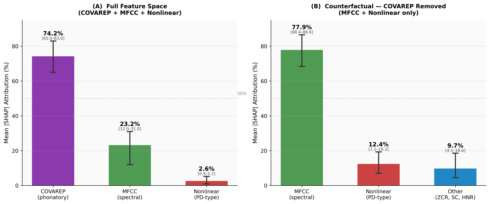
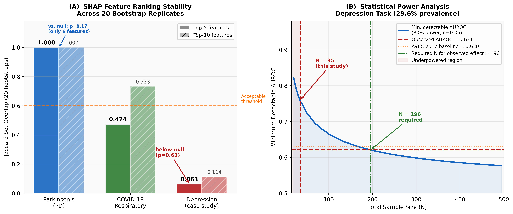
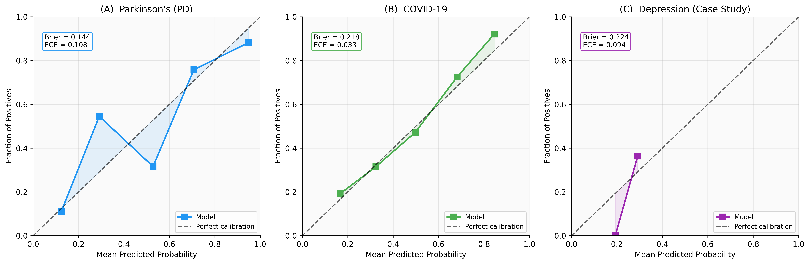

# Subject-Independent Evaluation and Within-Recording Attribution for Voice-Based Health Classification

**Parkinson's disease, COVID-19, and an exploratory depression case study**

Aditya Raj¹\* and Prashant Kumar²

¹ Department of Computer Science (AI/ML), Bennett University, Greater Noida, India
² Independent Researcher

\*Corresponding author: adityarajdhuria@gmail.com

This repository accompanies the manuscript of the same title (currently under peer review). It is not a medical device and is not intended for clinical use.

---

## Key Findings

- **Evaluation-protocol leakage (PD):** fold-based cross-validation inflates AUROC by 0.13 relative to subject-independent Leave-One-Subject-Out (LOSO) evaluation on identical data (0.932 fold-CV vs. 0.802 LOSO) — a gap consistent with subject-level leakage documented elsewhere in the PD voice literature.
- **Parkinson's Disease Detection:** AUROC 0.802 [95% CI 0.728–0.870], under subject-independent LOSO (UCI, *N*=195 recordings, 32 subjects).
- **COVID-19 Respiratory Screening:** AUROC 0.702 [95% CI 0.683–0.721], under **participant-grouped** 5-fold CV (Coswara, *N*=5,238 recordings, 2,709 participants). Recording-level 5-fold CV on the same data yields 0.755 — a 0.05-point gap consistent with the same leakage pattern found for PD.
- **Depression (exploratory case study, DAIC-WOZ, AVEC 2017 development set, *N*=35):** AUROC 0.621 [95% CI 0.416–0.816], not significant against chance (*p*=0.126, permutation test), reported as the mean across 10 random seeds because this pipeline's feature selection is measurably seed-sensitive at *N*<sub>train</sub>=107. The full DAIC-WOZ corpus has 142 sessions, but only the 35-participant development set is used for classification and power claims; the 107 training participants are used solely to fit the model.
- **Within-recording attribution:** PD-type nonlinear features receive only 2.6% of SHAP attribution for the depression classifier when extracted from the same audio as COVAREP and MFCC features — consistently the lowest-attributed group across the full feature space, a cardinality-matched analysis, and a COVAREP-removed counterfactual.
- **Cross-condition transfer:** a PD classifier applied to the same DAIC-WOZ audio shows no discriminative transfer to depression (AUROC 0.434, *p*>0.05).
- Random Forest is benchmarked against XGBoost and LightGBM: statistically indistinguishable for PD, significantly outperforms both for COVID-19 (DeLong *p*<0.001).
- A Hanley–McNeil power analysis estimates that approximately *N*≥196 participants would be required to detect an effect of the observed depression magnitude at 80% power, under the stated assumptions.

---

## Overview

### Why this work matters

Most voice-biomarker studies evaluate a single health condition in isolation, and evaluation practices vary widely across that literature: many use subject-dependent cross-validation, few report calibration, and almost none test whether classifiers for different conditions rely on the same acoustic features. This repository addresses both gaps.

**First**, we provide a rigorously evaluated, calibrated screening pipeline for Parkinson's disease (UCI Parkinson's) and COVID-19 respiratory screening (Coswara), and we directly quantify how much a common evaluation shortcut — fold-based cross-validation without subject-level holdout — inflates reported performance on the same data for both conditions.

**Second**, we introduce a within-recording attribution protocol: PD-type nonlinear, MFCC, and COVAREP features are extracted from the *same* audio recordings, and TreeSHAP is used to measure which feature family a classifier actually relies on. This is demonstrated as an exploratory case study on DAIC-WOZ depression audio (AVEC 2017 split).

This is a **parallel evaluation** under one shared methodology across three independent datasets and subject populations, not simultaneous multi-condition screening from a single individual. Conclusions concern model-level evaluation methodology and attribution separability; they do not establish biological biomarker independence, which would require co-labelled, multi-condition, prospective data.

---

## Results

### Primary screening performance

| Condition | Protocol | *N* (rec./part.) | AUROC [95% CI] | BACC | *F*₁ | Sens. | Brier | ECE |
|---|---|---|---|---|---|---|---|---|
| Parkinson's Disease (6 nonlinear features) | LOSO | 195 | 0.802 [0.728–0.870] | 0.671 | 0.882 | 0.946 | 0.144 | 0.108 |
| COVID-19 Respiratory | Participant-grouped 5-fold CV | 5,238 | 0.702 [0.683–0.721] | 0.653 | 0.634 | 0.623 | 0.218 | 0.033 |
| Depression (exploratory case study)† | AVEC 2017 dev | 35 | 0.621 [0.416–0.816] ns | 0.692‡ | 0.620‡ | 0.850‡ | 0.224 | 0.094 |

95% CI excludes 0.5 for PD and COVID-19 (equivalent to *p*<0.05); no separate hypothesis-test p-value is reported. ns not significant (*p*=0.126, permutation test). † Case-study dataset, N=35 evaluated development participants (142 total DAIC-WOZ sessions include 107 training-only participants); no clinical claim; all depression values are the mean across 10 random seeds (see Limitations). ‡ At each seed's own ROC-optimal (Youden *J*) threshold, then averaged. COVID-19 recording-level (non-grouped) 5-fold CV on the same data yields AUROC 0.755.

### Random Forest vs. modern tree ensembles

RF is not simply assumed superior — it is benchmarked directly against XGBoost and LightGBM under each condition's primary protocol:

| Condition | Comparison | Result |
|---|---|---|
| PD (LOSO) | RF vs. XGBoost | Statistically indistinguishable, DeLong *p*=0.780 |
| PD (LOSO) | RF vs. LightGBM | Statistically indistinguishable, DeLong *p*=0.836 |
| COVID-19 (participant-grouped CV) | RF vs. XGBoost | RF significantly outperforms, *z*=4.338, *p*<0.001 |
| COVID-19 (participant-grouped CV) | RF vs. LightGBM | RF significantly outperforms, *z*=3.901, *p*<0.001 |

RF matches both alternatives for PD and significantly outperforms both for COVID-19, in addition to enabling TreeSHAP-based attribution.

*(Raw AUROC values for the XGBoost/LightGBM comparison models under the corrected, participant-grouped COVID protocol are not yet reconciled with this README and have been omitted pending verification against the underlying analysis outputs.)*

### Within-recording attribution separability

Three feature families extracted from the *same* DAIC-WOZ audio, evaluated by a Random Forest trained on the shared 178-dimensional feature space:

| Feature type | Full space | Counterfactual (no COVAREP) | Matched (5+5+5) |
|---|---|---|---|
| COVAREP (phonatory) | 74.2% | — | 32.5% ± 4.8% |
| MFCC (spectral) | 23.2% | 77.9% | 41.0% ± 4.0% |
| Nonlinear (PD-type) | 2.6% | 12.4% | 26.5% ± 2.5% |
| Other (ZCR, spectral centroid, HNR) | — | 9.7% | — |

Nonlinear (PD-type) features consistently receive the lowest attribution across every configuration tested. Group ablation corroborates this: removing nonlinear features changes dev AUROC by only −0.018, removing MFCC by −0.007, while removing COVAREP *increases* AUROC by +0.182 — revealing that COVAREP's high SHAP share partly reflects overfitting at *N*<sub>train</sub>=107 rather than generalisable importance.

### Additional findings

- **Cross-condition transfer (null result):** the PD classifier, retrained on the matching five-feature nonlinear set, applied to DAIC-WOZ nonlinear features shows no discriminative transfer to depression (AUROC 0.434 [0.344–0.527], Mann–Whitney *U*=1824.5, *p*=0.139).
- **SHAP stability:** PD's numerically perfect top-5 Jaccard (1.000) is statistically indistinguishable from its own null (0.722, *p*=0.166), since with only 6 total features, random draws overlap heavily by construction. COVID-19's corrected, participant-grouped top-5 Jaccard is 0.474, genuinely above its null of 0.164 (*p*=0.006); the recording-level (leaked) estimate for this same statistic had been an inflated 1.000. The depression model operates at the noise floor (Jaccard=0.063, below its own null of 0.099), so depression attribution is reported only at the feature-group level, never as individual feature rankings.
- **Statistical power:** a Hanley–McNeil analysis shows the minimum detectable AUROC at *N*=35 (80% power) is 0.757; detecting the observed depression effect (0.621) is estimated to require approximately *N*≥196 participants under these assumptions.
- **Cross-dataset generalisation:** a model trained on shared traditional features performs near chance transferring from UCI Parkinson's to Sakar 2013, consistent with dataset-specific rather than generalisable signal.
- **Cross-model SHAP overlap:** separately trained PD and COVID-19 models share zero features in their top-15 SHAP rankings (Fisher's exact, one-sided, *p*=1.2×10⁻⁴ at top-15; not significant at top-5/10, reflecting the smaller sample size at those cutoffs).
- **Held-out attribution reanalysis:** SHAP computed on the held-out AVEC development set, rather than the training set, closely confirms the main attribution findings: nonlinear attribution shifts by under 0.5 percentage points in both the full space (2.6% to 2.7%) and matched configuration (26.5% to 26.3%), and held-out Jaccard stability (0.072) closely matches the training-set value (0.063).
- **Null results, reported transparently:** zero significant PHQ-8 symptom correlations across 1,168 tests under Bonferroni and Benjamini–Hochberg correction.

All within-dataset results are same-distribution upper bounds, not generalisation estimates.

---
## Installation

```bash
git clone https://github.com/AAdii-15/PulseIQ-AI.git
cd PulseIQ-AI
conda env create -f environment.yml
conda activate pulseiq
```

A pip-based setup is also available through `requirements.txt`.

## Datasets

Raw data is not redistributed. Download each dataset from its original source; see `data/README_DATA.md` for details. Pre-extracted COVAREP features for DAIC-WOZ are included under `data/features/` for reproducibility. **Raw DAIC-WOZ audio is deliberately excluded from this repository**, consistent with its USC ICT data use agreement.

| Dataset | Condition | *N* | License | Source |
|---|---|---|---|---|
| UCI Parkinson's (Little et al., 2009) | Parkinson's | 195 recordings, 32 subjects | CC BY 4.0 | https://archive.ics.uci.edu/dataset/174/parkinsons |
| Coswara (Sharma et al., 2020) | COVID-19 | 5,238 recordings, 2,709 participants | CC BY 4.0 | https://github.com/iiscleap/Coswara-Data |
| DAIC-WOZ (Gratch et al., 2014) | Depression | 142 sessions (35 evaluated dev participants) | USC ICT agreement | https://dcapswoz.ict.usc.edu/ |

## Figures

**Pipeline overview**


**SHAP feature-group attribution, full space and COVAREP-removed counterfactual**



**Jaccard stability against simulated null, and Hanley–McNeil power curve**



**Calibration reliability diagrams**



## Reproducing the Results

| Step | Script | Produces |
|---|---|---|
| 1 | `python src/models/train.py` | PD and COVID-19 Random Forest models |
| 2 | `python src/models/train_depression_svm.py` | Depression SVM model (primary screening result) |
| 3 | `python src/evaluation/covid_final_corrected.py` | Corrected, participant-grouped COVID-19 AUROC (0.702) |
| 4 | `python src/evaluation/covid_participant_leakage.py` | COVID-19 recording-level vs. participant-grouped leakage comparison (0.755 vs. 0.702) |
| 5 | `python src/evaluation/covid_tree_ensemble_corrected.py` | RF vs. XGBoost vs. LightGBM under the corrected COVID-19 protocol |
| 6 | `python src/evaluation/covid_leakage_seed_check.py` | COVID-19 leakage seed-robustness check |
| 7 | `python src/evaluation/ablation_study.py` | Feature group ablation |
| 8 | `python src/evaluation/fix2b_shared_space.py` | Within-recording SHAP attribution (full space) |
| 9 | `python src/evaluation/resolve_counterfactual_discrepancy.py` | Counterfactual SHAP attribution, resolved (MFCC 77.9%, includes "Other" category) |
| 10 | `python src/evaluation/heldout_shap_reanalysis.py` | Held-out (dev-set) SHAP reanalysis confirming training-set attribution findings |
| 11 | `python src/evaluation/cluster_robust_inference.py` | Participant-clustered reanalysis of DeLong/McNemar comparisons |
| 12 | `python src/evaluation/estimand_verification.py` | Participant-level vs. recording-level aggregation check |
| 13 | `python src/evaluation/jaccard_null_and_covid_corrected.py` | Corrected COVID-19 Jaccard stability against simulated null |
| 14 | `python src/evaluation/shap_analysis.py` | Cross-model SHAP rankings |
| 15 | `python src/evaluation/depression_seed_robustness.py` | Depression seed-robustness check (10 seeds) |
| 16 | `python src/evaluation/depression_final_v2.py` | Final depression AUROC/BACC/F1/Sens with combined seed+bootstrap CI |
| 17 | `python src/evaluation/depression_permutation_test.py` | Depression permutation test (*p*=0.126) |
| 18 | `python src/evaluation/fix_biomarker_overlap_fisher_test.py` | Cross-model SHAP overlap test |
| 19 | `python src/evaluation/phq8_analysis.py` | PHQ-8 symptom null analysis |
| 20 | `python src/evaluation/gen_fig_calibration.py`, `gen_fig1_iconstyle.py`, `gen_fig_stability_power_BSPC.py` | Main text figures |

Every reported number traces to a CSV in `results/metrics/` or the console output of one of the scripts above.

## Demo

`demo.py` records microphone audio and outputs probability scores and top SHAP drivers. It requires trained model files, which are not tracked in version control due to size — regenerate them via steps 1–2 above.

```bash
python demo.py
```

## Repository Structure
PulseIQ-AI/
├── src/
│ ├── feature_extraction/ # dataset loaders, COVAREP/MFCC/nonlinear extraction
│ ├── models/ # PD/COVID-19 RF, depression SVM
│ └── evaluation/ # SHAP analysis, statistical tests, seed robustness,
│ # tree-ensemble comparison, calibration, figures
├── results/
│ ├── metrics/ # one CSV per reported result
│ └── figures/ # paper figures (600dpi PNGs)
├── data/
│ ├── features/ # pre-extracted COVAREP features (DAIC-WOZ)
│ └── README_DATA.md # dataset download instructions
├── demo.py
├── environment.yml
├── requirements.txt
└── LICENSE

Trained model files (`.pkl`, `.pt`) and raw audio are not tracked in version control (size and data-use-agreement reasons respectively). Regenerate models by running the training scripts above, or contact the authors.

## Limitations

The manuscript reports a full limitations discussion in its Discussion and Limitations sections. The most important points:

- There is no co-labelled multi-condition dataset, so within-recording attribution separability does not establish biological biomarker independence.
- The depression analysis is a case study, not a validated screening result: the AVEC 2017 development set (*N*=35) is fundamentally underpowered, and this pipeline's feature selection is measurably seed-sensitive at *N*<sub>train</sub>=107 — all reported depression values are seed-averaged for this reason.
- Cross-dataset generalisation was not achieved; within-dataset results are same-distribution upper bounds only.
- SHAP attribution is computed on the training set; a held-out reanalysis on the AVEC development set confirms the main findings are not a training-overfitting artefact (see Figures).
- A participant-clustered reanalysis confirms all COVID-19 comparisons but not the PD RF-vs-logistic-regression McNemar result specifically (cluster-permutation *p*=0.15).
- All speech is in English; cross-lingual generalisation is untested.

## Citation

If you use this code, please cite the manuscript associated with this repository (citation details to be updated upon publication).

## Acknowledgements

The authors thank the creators of the UCI Parkinson's, Coswara, and DAIC-WOZ datasets for making their data publicly available.

## License

Released under the MIT License (see `LICENSE`). The datasets remain subject to their own licenses.
